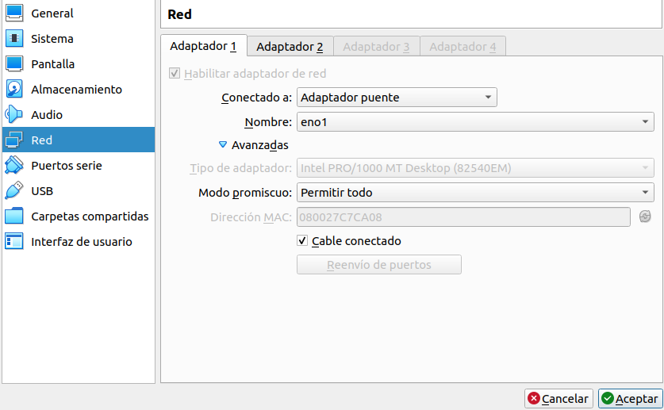
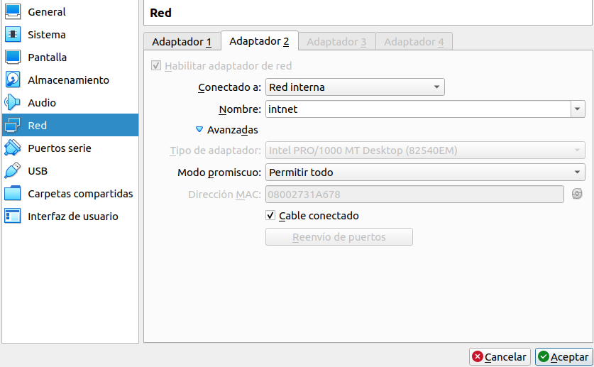
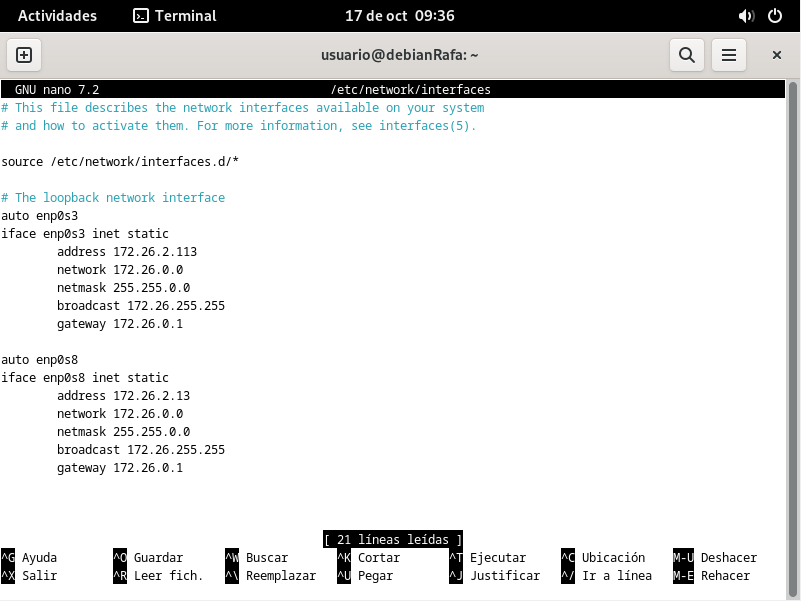
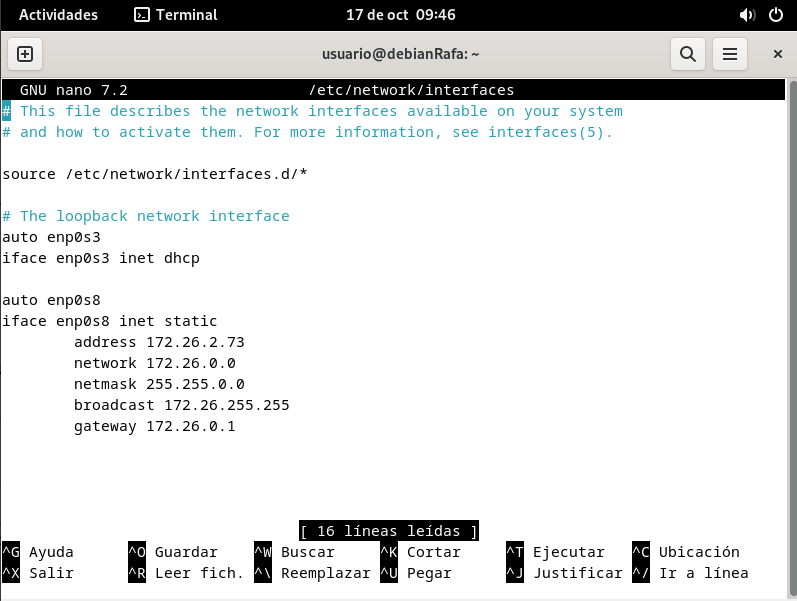
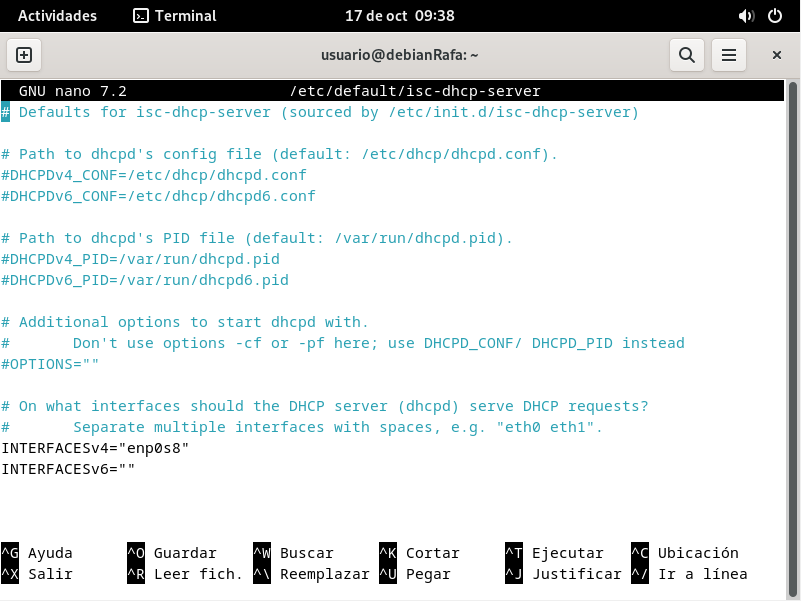
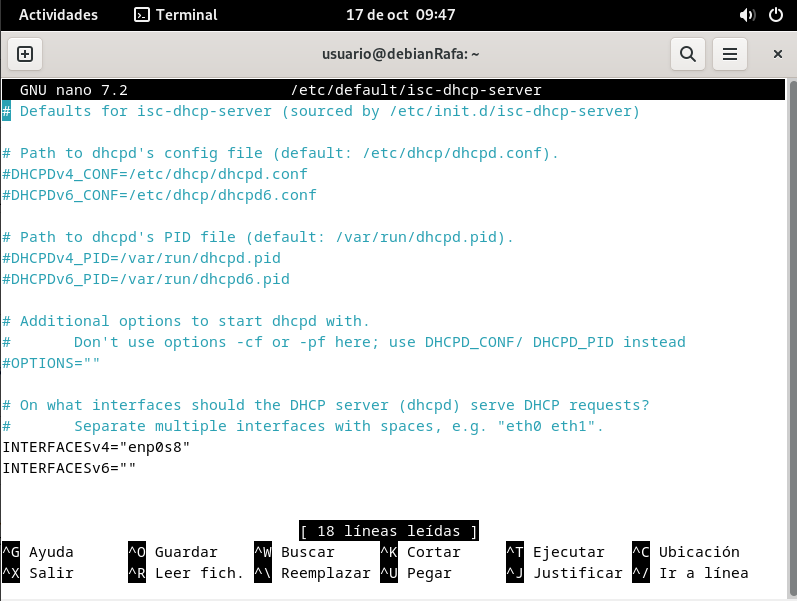

## Preparación de la máquina
Lo primero que debemos hacer es confifurar ambas máquinas servidor para que tengan una interfaz de red como adaptador puente y una segunda interfaz como red interna, ambas en modo promiscuo "permitir todo"

## Actualización del Sistema
Primero, es necesario ejecutar los siguientes comando:
- sudo apt update
- sudo apt upgrade

Con ellos mantendremos nunestro equipo totalmente actualizado para descargar las últimas versiones de los softwares necesarios

## Instalación de paquetes
Una vez instaladas las actualizaciones, instalaremos el paquete isc-dhcp-server:
- sudo apt install isc-dhcp-server

## Desactivar NetworkManager
Antes de empezar a configurar la red, desactivaremos NetworkManager con los siguientes comandos:
- systemctl disable NetworkManager
- systemctl stop NetworkManager

El primer comando hará que no se active cuando se inicie el sistema, y el segundo lo apagará en ese mismo momento

## Configurar Red
1. Una vez creadas las máquinas y realizado todo lo anterior, se empezará a configurar el fichero /etc/network/interfaces en ambos equipos, para añadirle una ip estática.

2. Luego editaremos el fichero /etc/default/isc-dhcp-server para indicar cuál de las tarjetas será la que se ejecutará como servidor DHCP

3. Configuramos los DNS en el fichero /etc/resolv.conf. Yo he puesto los de google
4. Por último, configuramos el fichero /etc/dhcp/dehcpd.conf, en el cuál indicaremos que el servidor usará failover. Es importante, al introducir las direcciones ip, que sean las de las redes internas y no las de los adaptadores puente.
